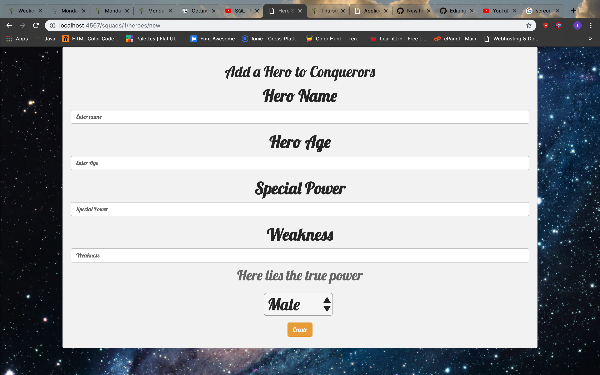

# HeroSquad
This program allows users to create superhero squads, create superheros specifying their abilitites, weaknesses and general attributes
and add them to the squads they just creates

Version 1.0.0

# Contributors
Raymond Gitonga

## Description and Usage
This program uses spark forms and the velocity template engine to allow users to create individual heros specify
their attributes and add them to a squad they have created. Spark allows the users to save the data they have creates into 
sessions and display them. The functionality of this program has been created using Java, with the creation of Individual 
classes to hold Hero and Squad attributes. 

## BDD
|Behaviour   	|  Input  	|   Output	|   	
|---	|---	|---	|
|Create Squad  	|Build your squad|Squad created add heros|   	
|Create hero	|Message:Create your superhero|Superhero created	|  
|Add Hero to squad	|Add hero to squad|Hero added to squad	|

## Setup Installation Requirement
To access this project, you will need to access it from github then clone it.
Then run 'git clone https://github.com/raymondleta/HeroSquad' on your terminal

## Technologies Used
1. Java
2. Spark Micro-framework
3. Velocity Template Engine
4. CSS

### Support or questions
For any questions feel free to contact me through gitongaraymondd@gmail.com

## License 
MIT 2019
Raymond Gitonga
